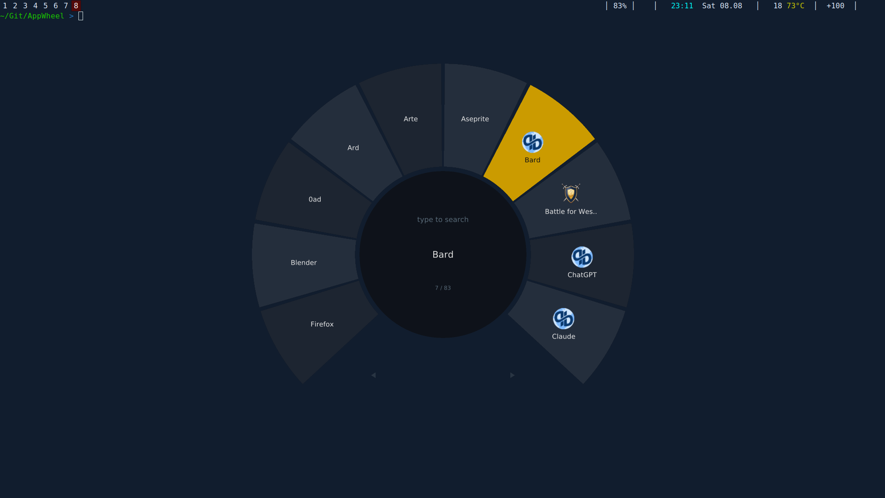

# appwheel

A GTA-V-style radial **weapon-wheel launcher** for your apps, in one C file.
Point at a slice to pick an app, type to filter, hit Enter to launch. Runs on
**Wayland & X11** (SDL3).



> ### ⚠️ Heads up: this is a 100% vibe-coded project
> Every line here was written by **Claude (Anthropic)** from a chat conversation —
> design, code, and docs. It compiles clean and was exercised in a headless test
> sandbox against SDL3 3.2.14, but it has **not** been run on a real GPU or
> compositor by a human. Treat it as a solid starting point, not battle-tested
> software: skim the source, and if something misbehaves on your setup, say so and
> it can be fixed. It's GPL-2.0 — do whatever you like with it.

---

## Features
- Radial wheel of your `.desktop` apps; mouse-angle to select.
- Center **search box** — type to filter the wheel live.
- **Icons** from your icon theme (PNG/JPG/BMP).
- **Smooth text** (real TrueType) and **anti-aliased** ring edges.
- **Transparent** background (with a compositor).
- Handles **hundreds of apps**: a few wide slots up top, "load more" paging at the
  bottom that eases from slow to fast.
- **Recent-first** ordering (or A–Z), plus `include`/`exclude` allow-lists.
- Everything is configurable from a file **or** the command line — no recompiling.

## The whole project is these files
| file | what it is |
|------|-----------|
| `appwheel.c` | the program (one file) |
| `stb_truetype.h`, `stb_image.h` | vendored public-domain headers (fonts + images) — **keep them next to `appwheel.c`** |
| `appwheel.config.example` | a ready-to-edit config (same as `--dump-config`) |
| `Makefile` | `make`, `make static`, `make install`, `make config` |
| `LICENSE` | GNU GPL v2 |

The **only library you link is SDL3**. The two `stb_*.h` files aren't packages —
they just sit beside the source and get `#include`d, so there's nothing extra to
install.

---

## Install

### 1. Install the build dependencies
You need a C compiler, `pkg-config`, and **SDL3** (dev headers).

| Distro | Command |
|--------|---------|
| Arch / Manjaro | `sudo pacman -S sdl3 gcc pkgconf` |
| Fedora (41+) | `sudo dnf install SDL3-devel gcc pkgconf-pkg-config` |
| Debian 13+ / Ubuntu 24.10+ | `sudo apt install libsdl3-dev gcc pkg-config` |
| openSUSE | `sudo zypper install SDL3-devel gcc pkg-config` |

**No SDL3 package?** (e.g. Ubuntu 24.04 and older don't have one yet.) Build it once
from source:
```sh
git clone https://github.com/libsdl-org/SDL.git
cd SDL && cmake -B build -DCMAKE_BUILD_TYPE=Release && cmake --build build -j
sudo cmake --install build          # installs to /usr/local
sudo ldconfig
cd ..
```

### 2. Get appwheel
Put `appwheel.c`, `stb_truetype.h`, and `stb_image.h` in the same folder. (If you
downloaded them here, you already have that.)

### 3. Build it
With the included Makefile (easiest):
```sh
make            # -> ./appwheel
```
Or by hand:
```sh
cc appwheel.c -o appwheel $(pkg-config --cflags --libs sdl3) -lm
```
That produces an `appwheel` binary in the current directory. Try it:
```sh
./appwheel
```
> If you built SDL3 from source and `pkg-config` can't find it, point it at the
> right place first:
> ```sh
> export PKG_CONFIG_PATH=/usr/local/lib/pkgconfig
> export LD_LIBRARY_PATH=/usr/local/lib     # so it can find libSDL3 at runtime
> ```

### Static build (optional)
```sh
make static
```
This bakes SDL3 into the binary (`libSDL3.a`), so it no longer needs `libSDL3.so`
installed — handy for dropping the single file on another machine. Caveats:
- It needs SDL's **static** library (`libSDL3.a`); distro packages don't always ship
  it, so you may need to build SDL from source with `-DSDL_STATIC=ON`.
- SDL still loads your system's **Wayland/X11** libraries at runtime via `dlopen`,
  so this removes the SDL install requirement, not literally every dependency —
  and a *fully* static (`-static`) binary is a poor fit for SDL for that reason.
- **`make static` does not make it portable across distros.** glibc stays dynamic,
  and glibc is forward-incompatible: a binary built on a bleeding-edge distro (Arch,
  etc.) will fail on older Ubuntu with `GLIBC_2.xx not found`.

### Running it on other distros (fixing `GLIBC_2.xx not found`)
Build against the **oldest glibc** you need to support. Easiest is to build on that
machine directly (Install steps above). To produce **one binary that runs on many
distros**, compile inside an older Ubuntu container with the included script (needs
Docker or Podman):
```sh
./build-portable.sh          # builds against ubuntu:22.04 (glibc 2.35)
./build-portable.sh 20.04    # older glibc 2.31 -> even wider compatibility
```
The result runs on that Ubuntu release and anything newer. It pins a known-good SDL
release (`release-3.2.14`) and links it statically; override with
`SDL_TAG=release-3.2.30 ./build-portable.sh` if you want a newer one. (There's still
no prebuilt binary in this repo on purpose — a portable build has to be pinned to a
specific glibc/toolchain, which is a choice best made on your end.)

### 4. Put it on your PATH
```sh
make install                 # installs to ~/.local/bin (override with PREFIX=)
```
or copy it yourself:
```sh
mkdir -p ~/.local/bin && cp appwheel ~/.local/bin/
```
Make sure `~/.local/bin` is on your `PATH` (most modern distros do this already;
if not, add `export PATH="$HOME/.local/bin:$PATH"` to your shell rc). Now you can
just run `appwheel`.

### 5. (Optional) create a config
```sh
mkdir -p ~/.config/appwheel
appwheel --dump-config > ~/.config/appwheel/config
```
Open that file and tweak — it's fully commented. Nothing is required; appwheel runs
fine with no config at all.

### 6. Bind it to a key
appwheel is meant to be launched on a hotkey (like bemenu/dmenu). Pick your setup:

**Hyprland** — `~/.config/hypr/hyprland.conf`
```
bind = SUPER, A, exec, appwheel
# make the borderless window float & center, and let it be see-through:
windowrulev2 = float, class:^(appwheel)$
windowrulev2 = center, class:^(appwheel)$
```

**sway** — `~/.config/sway/config`
```
bindsym $mod+a exec appwheel
for_window [app_id="appwheel"] floating enable, move position center
```

**i3 / X11** (needs a compositor like `picom` for transparency) — `~/.config/i3/config`
```
bindsym $mod+a exec appwheel
for_window [class="appwheel"] floating enable
```

**Generic (sxhkd)** — `~/.config/sxhkd/sxhkdrc`
```
super + a
    appwheel
```

---

## Using it
| do this | to |
|---------|----|
| move mouse over the top arc | highlight a slot |
| bottom-left / bottom-right | page back / forward (deeper = faster) |
| scroll wheel | scroll the list under the fixed highlight |
| type | filter by name |
| Backspace | edit the filter |
| Enter / left-click | launch |
| Esc | clear filter, else quit |
| right-click | quit |

---

## Configuration

**Where:** `~/.config/appwheel/config` (or `appwheel -c /some/path`).
**Format:** one `key=value` per line; `#` starts a comment.
**Command line:** every key also works as an argument, in either form, and
overrides the file:
```sh
appwheel slots=8 arc=220 ssaa=3
appwheel --slots=8 --arc=220 --ssaa=3
```
**Generate a starter file:** `appwheel --dump-config > ~/.config/appwheel/config`

### Keys
| key | default | meaning |
|-----|---------|---------|
| `slots` | `10` | wide app slots across the top arc |
| `arc` | `240` | degrees of the ring used for apps (rest = paging zone) |
| `page_ms` | `110` | ms per paged step at the **slow** end; bigger = calmer start |
| `ssaa` (`aa`) | `2` | full-scene supersampling 1–4 (smooths edges) |
| `icons` | `1` | show `.desktop` icons (PNG/JPG/BMP) |
| `icon_px` | `46` | icon size (before `ui_scale`) |
| `ui_scale` | `1.0` | master text size (aliases `font_scale`, `text_scale`) |
| `label_px` | `17` | app labels on the wheel (× `ui_scale`) |
| `title_px` | `23` | selected app name in the center (× `ui_scale`) |
| `search_px` | `18` | the text you type in the search box (× `ui_scale`) |
| `count_px` | `14` | the "3 / 42" counter (× `ui_scale`) |
| `font` | desktop default | a `.ttf` path **or** a fontconfig family (e.g. `JetBrains Mono`) |
| `font_px` | `48` | glyph atlas height (sharpness ceiling for big text) |
| `sort` | `recent` | `recent` or `alpha` (order when the search box is empty) |
| `launcher` | `sh` | `sh` = run `Exec=` · `gtk-launch` = launch by id |
| `terminal` | `xterm` | terminal for `Terminal=true` apps when `launcher=sh` |
| `dirs` | (auto) | colon-separated dirs to scan instead of the defaults |
| `include` | – | show **only** these ids, in this exact order |
| `exclude` | – | hide these (matches id **or** Name) |
| `history` | `~/.cache/appwheel/history` | recency file |
| `width` `height` `fullscreen` | `900 900 0` | window size |

**Colors** (`#rrggbb` or `#rrggbbaa`): `bg ring ring2 hl text hltext center accent dim`.
A `bg` alpha below `ff` makes the window background transparent (needs a
compositor). A leading `~/` is expanded in `dirs`, `history`, `font`, and `-c`.

**Font:** by default appwheel uses your **desktop's configured font**, resolved
through fontconfig's `fc-match` (the same source GTK/Qt apps use). Set `font=` to a
`.ttf` path or a family name (e.g. `font=Inter`) to override. If `fc-match` isn't
installed it falls back to a short list of common fonts, then to a built-in one.

### Sources & ordering — what's an "id"?
An app's **id** is just its `.desktop` filename without the extension:

| file | id |
|------|----|
| `/usr/share/applications/firefox.desktop` | `firefox` |
| `~/.local/share/applications/spotify.desktop` | `spotify` |

Run `appwheel --list` to print every id next to its Name, then use them:
```sh
appwheel include=firefox,code,gimp   # a curated wheel, in that order
appwheel exclude=htop,xterm          # hide these
```
Default scan path, in priority order: `$XDG_DATA_HOME/applications` →
`$XDG_DATA_DIRS/*/applications` → `/opt/*/share/applications`, skipping
`NoDisplay`/`Hidden` entries.

### Most-recently-used first (on by default)
appwheel **logs every app you launch** to `~/.cache/appwheel/history` (most-recent
first, de-duplicated) and shows those at the front of the wheel. This is the
default — `sort=recent` — so your common apps drift to the top as you use it, just
like a dmenu/bemenu `last` log. Set `sort=alpha` for plain A–Z instead, point
`history=` somewhere else, or delete the file to reset. (An `include=` list forces
its own fixed order and ignores recency.)

---

## Troubleshooting
- **`Package sdl3 was not found by pkg-config`** → install the SDL3 dev package
  (table above), or if you built from source: `export PKG_CONFIG_PATH=/usr/local/lib/pkgconfig`.
- **`error while loading shared libraries: libSDL3.so.0`** → for a source-built
  SDL3, `sudo ldconfig` once, or `export LD_LIBRARY_PATH=/usr/local/lib`.
- **Background isn't transparent** → you need a running compositor. If yours can't
  do it, set an opaque background, e.g. `bg=0d1117ff`.
- **Some apps have no icon** → their theme ships that icon only as SVG, which isn't
  decoded (see limitations). The app still shows with its label.
- **Text looks blocky / wrong font** → `fc-match` wasn't found or returned nothing,
  so the built-in font is in use. Install `fontconfig`, or set `font=/path/to.ttf`.
- **A launched app messes up the terminal I started appwheel from** → shouldn't
  happen: appwheel launches every app fully detached (its own session, no
  controlling terminal, std streams sent to `/dev/null`). If you still see it,
  it's worth reporting.
- **Window doesn't center in a tiling WM** → add the floating/center rule for your
  compositor (see step 6).

## License
**GPL-2.0-only** — see `LICENSE`. The bundled `stb_*.h` are public domain and SDL3
is zlib-licensed, both compatible with GPLv2. Put your own name in the copyright
line at the top of `appwheel.c` if you fork it.

## Known limitations
- **SVG/XPM icons aren't decoded** — only raster PNG/JPG/BMP. SVG-only themes show
  the label with no icon (a rasterizer like nanosvg could be added as one more header).
- **Text is Latin-1** (U+0020–U+00FF); CJK/emoji render as `?`.
- **Transparency depends on your compositor.**
